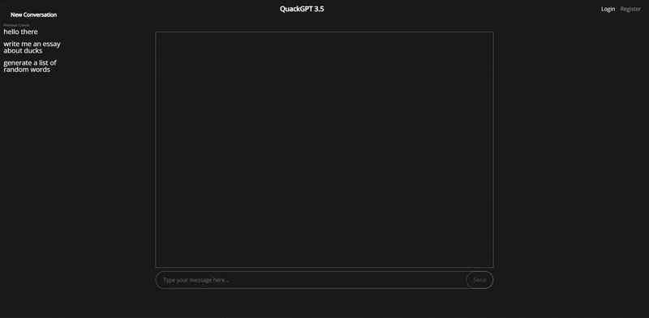

# QuackGPT
A chatbot designed around Google Gemini's model for learning, brainstorming ideas, or even just a friendly conversation partner. Its goal is to enhance user interactions and provide a conversational AI experience that is both entertaining and informative.

 

**Python 3.10+**
# 1. Install Dependencies
```bash
pip install -r requirements.txt
```

# 2. Set up the environment variables
| Variable            | Description                                               |
| ------------------- | --------------------------------------------------------- |
| GOOGLE_API_KEY      | Google Gemini API key, you can get one from [Google's API Key Page](https://makersuite.google.com/app/apikey) |
| JWT_SECRET          | A random secret key you create that will be used to sign the JWT tokens  |
| AWS_ACCESS_KEY_ID   | AWS IAM access key to access DynamoDB                       |
| AWS_SECRET_ACCESS_KEY|                                                      |


# 3. Run the app
```bash
python main.py
```
The default port is set to 8000. To run the server on a different port, use the -p option. For example:
```bash
python main.py -p 8080
```

# 4. Access the API documentation
1. After starting the server, visit http://127.0.0.1:8000/docs in your browser to access the Swagger-based interactive API documentation.

2. Alternatively, you can use the http://127.0.0.1:8000/redoc endpoint for the ReDoc documentation.
